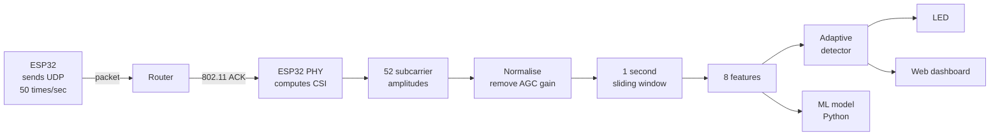

# Wi-Fi Motion Detector (ESP32 + CSI + Machine Learning)

Detect people moving through a room using nothing but Wi-Fi. No camera, no PIR
sensor, no wearable. A single ESP32 and the router you already own.

The device senses motion through walls and in complete darkness, hosts its own
live dashboard, and classifies motion with a machine learning model trained on
data recorded from your own room.

---

## How it works

A Wi-Fi radio does more than count signal strength. For every frame it
receives, the ESP32's PHY computes **Channel State Information (CSI)** — the
complex channel response of each of the 52 OFDM subcarriers in a 20 MHz
channel.

Each subcarrier is an independent narrowband probe of the room. When a body
moves, it changes the multipath geometry, and every subcarrier responds
differently. That gives a 52-dimensional signal instead of one noisy number.



### The sampling problem

CSI only exists when a frame arrives. An idle station hears beacons at roughly
10 Hz — far too slow and far too irregular for sensing.

The solution: **transmit** small UDP packets to the gateway at a fixed 50 Hz.
Every frame the ESP32 sends is acknowledged at the 802.11 layer by the access
point, and with `dump_ack_en` set in the CSI configuration the driver reports
CSI for those ACK frames.

One CSI record per packet sent, at any rate you choose, from a **single**
ESP32, with no cooperation required from the router.

### Two ideas that make it actually work

**Normalise every sample.** The ESP32's automatic gain control constantly
rescales the raw CSI magnitudes. Feed raw amplitudes to a detector and you
measure the AGC, not the room. Dividing each sample's 52 amplitudes by their
own mean removes the gain entirely and leaves only the *shape* of the channel
response. Measured effect: a sudden **2.5× gain jump produces zero false
detections**.

**Learn the room instead of hardcoding a threshold.** Every room has a
different amount of background fluctuation. The firmware spends its first 10
seconds measuring what "quiet" looks like *here*, then reports departures in
standard deviations. Trigger at 4σ, release at 2σ. The same binary works in a
bedroom or a lecture hall with no retuning.

There is a trap in adaptive baselines: motion *just below* the trigger gets
absorbed into the baseline, the score decays to zero, and the detector goes
blind to exactly the subtle activity you want to catch. A **guard band** fixes
it — the baseline stops learning above 1.5σ, well below the 4σ trigger.

| Disturbance (fraction of a walking body) | z-score without guard band | with |
|---|---|---|
| 0.3× | 0.2 | **1.1** |
| 0.9× | 3.9 | **6.4** |
| 1.2× | 6.9 | **11.2** |

---

## Features

- **CSI-based sensing** — 52 subcarriers at 50 Hz from a single ESP32
- **Self-calibrating detector** — learns the room, no per-site tuning
- **Gain-immune** — normalisation rejects AGC rescaling
- **Built-in web dashboard** — live subcarrier chart, motion score history,
  served by the ESP32 itself with no external dependencies
- **Machine learning pipeline** — record labelled data, train and compare five
  models, run predictions live
- **Honest evaluation** — time-block cross-validation, not the shuffled split
  that inflates time-series accuracy

---

## Hardware

| Item | Notes |
|---|---|
| ESP32 (classic) | ESP32-WROOM / DevKitC. Newer variants need CSI API changes |
| USB data cable | Charge-only cables will not work |
| LED + 220 Ω resistor | Optional. GPIO 19 → resistor → LED → GND |
| 2.4 GHz Wi-Fi network | The ESP32 cannot see 5 GHz networks |

---

## Quick start

**1. Install [ESP-IDF v5.5](https://docs.espressif.com/projects/esp-idf/en/stable/esp32/get-started/) and clone this repo.**

**2. Configure and build:**

```bash
idf.py set-target esp32
idf.py menuconfig      # → "Wi-Fi Motion Detector" → set SSID and password
idf.py build flash monitor
```

**3. Keep the room still for the first 10 seconds** while it learns the
baseline. Then look for:

```
I (5432) app:   DASHBOARD:  http://192.168.1.47/
I (11500) motion: baseline learned - detection active
```

**4. Open that address in a browser** and walk around.

### Adding machine learning

```bash
pip install numpy scikit-learn

python tools/record.py --ip 192.168.1.47    # guided: 3 min still, 3 min moving
python tools/train.py  data/session_*.csv   # compare 5 models, save the best
python tools/live.py   --ip 192.168.1.47    # live predictions
```

---

## Evaluating the model honestly

This is the part of the project most worth understanding.

Data recorded over time is not a pile of independent samples. Two rows recorded
a tenth of a second apart are almost identical. Shuffle the rows and split them
randomly — the standard approach — and nearly every test row has a near-twin in
the training set. The model does not learn what motion looks like; it memorises.
You get 99% accuracy and a detector that fails in the real room.

`train.py` splits by **five-second time blocks** instead. A whole block goes
entirely into training or entirely into testing, so the model is always
evaluated on moments it has never seen. It reports both numbers side by side:

```
model                   HONEST                              leaky
Logistic Regression      0.736  ##################......    0.751
Random Forest            0.720  #################.......    0.769
Gradient Boosting        0.712  #################.......    0.778
```

The gap is how much a shuffled split would have flattered you.

The model sees 20 numbers per decision: the 8 features the board computes, 8
summary statistics of the 52 subcarrier deviations, and 4 describing the last
second. The raw 52 values are deliberately *not* fed in — that pattern depends
on where the furniture and router happen to be, so a model trained on it
memorises one specific room.

---

## Repository layout

```
main/
  app_main.c        boot sequence, wires the pipeline together
  wifi_conn.c       station connect, all-channel scan, backoff retry
  csi_capture.c     CSI config, driver callback, subcarrier decode
  traffic_gen.c     fixed-rate UDP transmitter that generates the ACKs
  motion.c          normalisation, features, adaptive detector
  web_server.c      dashboard HTTP endpoints
  led.c             non-blocking indicator
  www/dashboard.html  the dashboard, embedded into the firmware binary

tools/
  record.py         guided labelled data collection over Wi-Fi
  train.py          model comparison with time-block cross-validation
  live.py           live prediction against the running device

docs/
  STEP1.md … STEP6.md   how each part was built and why
```

Everything is configurable under `idf.py menuconfig` → **Wi-Fi Motion
Detector**: sample rate, LED pin, scan method, serial CSV output.

---

## Design notes

**Why UDP to a dead port?** We only care about the link-layer ACK, not a reply.
The gateway silently drops the datagrams. Any frame that gets acknowledged
works.

**Why is power save forced off?** With `WIFI_PS_NONE` disabled the radio sleeps
between beacons. The sample rate collapses and the timing jitter destroys any
frequency-domain feature.

**Why `mean_absdiff` rather than variance as the primary statistic?** Variance
over a one-second window counts slow thermal drift as signal. A first
difference is naturally high-pass and therefore drift-immune, which matters
over runs of hours.

**Why is the dashboard embedded in the binary?** No SPIFFS partition to build,
flash, or keep in sync with the firmware.

**Why does the bar chart show deviation rather than absolute amplitude?** A real
Wi-Fi channel is frequency-selective — the quiet-room profile already swings
wildly between subcarriers, and that fixed shape dominates the vertical scale.
Subtracting the baseline puts every subcarrier on a common zero so only the
change is visible.

---

## Known limits

- Disturbances below roughly **40% of a walking body** are not caught by the
  statistical detector. This is the gap the ML model is meant to close.
- The device must see a **still room during its first 10 seconds** after boot,
  or it learns your movement as normal. Press *Relearn the room* on the
  dashboard to fix it.
- CSI describes **one radio path**. A person moving perpendicular to the
  ESP32–router line disturbs it less than one crossing it.
- A trained model is **specific to the room** it was recorded in. Moving the
  device means recording and training again.
- ESP32 classic only. ESP32-S3/C3/C6 expose a different CSI struct.

---

## Testing

Every component was verified before release:

| Component | How it was verified |
|---|---|
| Subcarrier decode | Host unit test: map covers exactly the 52 usable carriers with no duplicates; amplitude math checked; `first_word_invalid` hardware quirk confirmed not to leak garbage |
| Motion detector | Real `motion.c` run on host against synthetic CSI: **0 false positives in 292 quiet windows**, 0 flagged on a 2.5× gain jump, **4 of 4** walk-throughs detected, 92.5% recall |
| Dashboard | Rendered in headless Chromium against a simulated device in both states, no JavaScript errors |
| Recorder | End-to-end against a simulated device: correct schema, no duplicate or missing decisions, and its data-quality check correctly reported POOR on deliberately bad data |
| Training | Two synthetic datasets — on easy data all models hit 100% and the script warned that this is suspicious; on hard data the honest score came out below the leaky score for **every** model, proving the time-block split works |
| Live prediction | 571 predictions against a simulator alternating every 8 s; all 7 events detected with correct spacing, 94% agreement with the on-device detector |
| Firmware | Compiles clean against ESP-IDF v5.5.3 — 0 errors, 0 warnings |

---

## Background

Wi-Fi sensing is an established research area. Useful entry points:

- Halperin et al., *Tool Release: Gathering 802.11n Traces with Channel State Information* (2011)
- Wang et al., *Understanding and Modeling of WiFi Signal Based Human Activity Recognition* (MobiCom 2015)
- [Espressif Wi-Fi Channel State Information docs](https://docs.espressif.com/projects/esp-idf/en/stable/esp32/api-guides/wifi.html#wi-fi-channel-state-information)

## License

MIT
